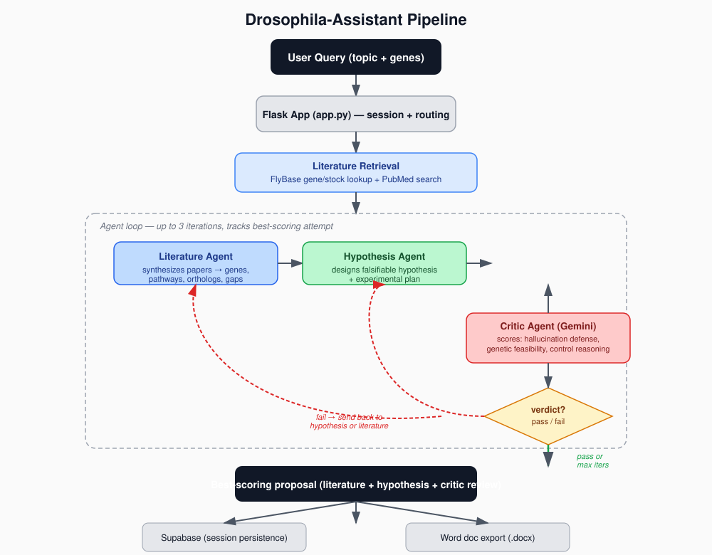

# Drosophila-Assistant

A multi-agent AI pipeline that helps design experimental proposals for *Drosophila melanogaster* genomics research. Give it a research topic and a set of genes, and it retrieves relevant literature, drafts a testable hypothesis and experimental plan, then critiques and refines the proposal automatically before handing back a finished draft.

## How it works



1. **Literature Retrieval** — pulls gene/stock data from FlyBase and relevant papers from PubMed for the given genes and topic.
2. **Literature Agent** — synthesizes the retrieved papers into a structured summary: relevant genes, signaling pathways, human orthologs, disease relevance, and specific gaps in current knowledge.
3. **Hypothesis Agent** — turns that synthesis into a falsifiable, quantified hypothesis with a concrete experimental plan (fly lines, GAL4/UAS design, controls, expected outcomes).
4. **Critic Agent (Gemini)** — independently scores the proposal on three axes: hallucination defense (no fabricated genes/papers), genetic feasibility (are the fly lines and crosses real and workable), and control reasoning. Using a different model family than the generator avoids shared blind spots between generator and critic.
5. **Routing loop** — if the critic fails the proposal, it's sent back to the Hypothesis Agent (or all the way back to Literature Retrieval, if the issue is upstream) for another pass. This repeats up to 3 iterations, and the pipeline keeps the best-scoring attempt seen so far.
6. **Output** — the final proposal is persisted to Supabase and can be exported as a Word document.

## Tech stack

- **Backend:** Flask, streamed via Server-Sent Events for live pipeline progress
- **Database:** Supabase (PostgreSQL)
- **Hosting:** Render
- **LLMs:** Claude (Literature + Hypothesis agents), Gemini (independent Critic agent)
- **Literature sources:** FlyBase, PubMed (via Biopython/Entrez)
- **Export:** python-docx for Word document generation

## Project structure

```
app.py                       # Flask routes, session handling, SSE streaming
drosophila_assistant.py      # Core assistant logic, literature fetching (FlyBase/PubMed)
database.py                  # Supabase persistence
docx_export.py               # Proposal/experiment-design → Word doc export
research_planner.py          # Research planning support logic
agents/
  pipeline.py                 # Orchestrates the Literature → Hypothesis → Critic loop
  literature_agent.py          # Synthesizes papers into structured findings
  hypothesis_agent.py          # Drafts falsifiable hypothesis + experimental plan
  gemini_critic_agent.py       # Independent critic, scores + routes iterations
static/index.html             # Frontend
```

## Setup

```bash
git clone https://github.com/Jordan5342/Drosophilia-Assistant.git
cd Drosophilia-Assistant
pip install -r requirements.txt
```

Environment variables (`.env`):

```
ANTHROPIC_API_KEY=
GEMINI_CRITIC_MODEL=gemini-3-flash   # optional override
SUPABASE_URL=
SUPABASE_KEY=
```

Run locally:

```bash
python app.py
# or
./start.sh
```

## Status

Actively in development.

## Credits

Built by Jordan Sztejman
